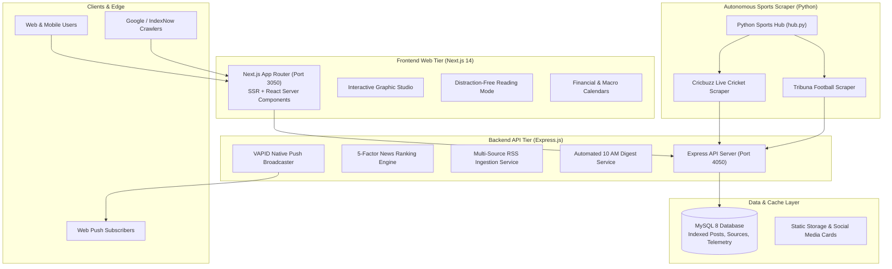

# NewsFree365

An enterprise-grade, full-stack intelligence and real-time news platform engineered with **Next.js 14 (App Router)**, **Express.js (Node.js)**, **MySQL 8**, and an autonomous **Python Sports Hub**.

Designed for high availability, sub-second latency, zero-downtime production deployments, rich interactive readers, real-time sports telemetry, economic agenda tracking, and automated RSS multi-source news synthesis.

---

## 🏛️ System Architecture



---

## ⚡ Key Highlights & Capabilities

### 📰 1. Real-Time Multi-Source News Engine
- **Automated RSS Monitoring**: Continuous background ingestion across global news agencies (BBC, Reuters, Mint, TechCrunch, etc.).
- **URL & Content Deduplication**: Dual-hash SHA-256 canonical URL & title normalization to prevent duplicate stories.
- **5-Factor Dynamic Ranking**: Real-time scoring factoring in freshness decay, view velocity, reader engagement, source authority, and breaking editorial weight.
- **Rich Article Views**: Interactive reader with Text-To-Speech (TTS), distraction-free focus mode, timeline extractions, key takeaways, and social sharing.

### 🏏 2. Unified Sports Intelligence Hub
- **Live Cricket Telemetry**: Autonomous Playwright/Async scraper extracting live ball-by-ball commentary, wagon wheels, partnership charts, and mini-scorecards.
- **Football Match Center**: Real-time fixtures, live score updates, standings, and match commentary via Tribuna scrapers.
- **Zero Rate-Limiting Overhead**: Smart adaptive sync loops that automatically throttle polling rates during inactive match periods.

### 📅 3. Economic & Market Calendars
- **Macro Economic Calendar**: RBI Repo Rate, US Federal Reserve FOMC, CPI Inflation, GDP, and Industrial Production releases.
- **Market & Exchange Holidays**: Trading session hours, special Muhurat sessions, and holidays for NSE, BSE, MCX, and NYSE.
- **Commodities & Energy Agenda**: OPEC+ output quotas, US EIA crude inventories, and bullion contract expiries.

### 📬 4. Multi-Channel Distribution & Engagement
- **Self-Hosted Native Web Push**: High-throughput VAPID web push engine with OneSignal integration.
- **Automated Newsletter Broadcasts**: SMTP-powered 10:00 AM daily briefing engine with manual admin broadcast capabilities.
- **Interactive Newsroom Community**: Poll of the Day and Daily News Intelligence Quiz with real-time tallying.
- **Graphic Design Studio**: Built-in canvas image editor for creating social media banners, quotes, and branded visual cards.

---

## 📁 Repository Structure

```
policydrift-news/
├── backend/                      # Express.js REST API
│   ├── sql/                      # MySQL database schemas & migration scripts
│   ├── src/
│   │   ├── config/               # Environment, symbols, and RSS feed configs
│   │   ├── controllers/          # Request controllers (admin, news, cricket, etc.)
│   │   ├── db/                   # MySQL connection pool & storage metrics
│   │   ├── middleware/           # Auth, rate limiting, and admin protection
│   │   ├── models/               # Data access layer (posts, sources, polls, quiz)
│   │   ├── routes/               # Express route definitions
│   │   ├── services/             # Ingestion, ranking, push, email, sports services
│   │   ├── workers/              # Dedicated standalone cron worker (worker.js)
│   │   └── server.js             # API entrypoint
├── frontend/                     # Next.js 14 App Router
│   ├── app/                      # Routes (/, /news/[slug], /calendar, /editor, etc.)
│   ├── components/               # UI components (Header, Footer, ReadingMode, etc.)
│   ├── lib/                      # API clients, formatting, sanitization, theme tokens
│   └── types/                    # TypeScript interfaces & types
├── cricbuzz_scraper/             # Autonomous Python Sports Scraper Hub
│   ├── hub.py                    # Multi-sport orchestrator
│   ├── scraper.py                # Playwright cricket scraper
│   └── football_scraper.py       # Tribuna football scraper
├── docs/                         # Comprehensive technical documentation
│   ├── ARCHITECTURE.md           # Deep architectural specification
│   ├── API_REFERENCE.md          # REST API endpoint reference
│   ├── SPORTS_HUB.md             # Cricket & Football telemetry details
│   ├── DEPLOYMENT.md             # Zero-downtime PM2 operations guide
│   └── news-ranking.md           # 5-factor mathematical ranking guide
├── scripts/                      # Build guards and execution scripts
├── ecosystem.config.cjs          # PM2 production multi-process configuration
├── AGENTS.md                     # Strict build & operational protocol rules
└── package.json                  # Workspaces & script definitions
```

---

## 🚀 Quick Start Guide

### Prerequisites
- **Node.js**: `v18.x` or `v20.x`+
- **Python**: `v3.10`+ (with `playwright` & `asyncio`)
- **MySQL**: `v8.0`+
- **PM2**: `npm install -g pm2` (for daemon management)

---

### Step 1: Clone and Install Dependencies

```bash
git clone https://github.com/Rau238/policydrift-news.git
cd policydrift-news

# Install root, backend, and frontend dependencies
npm install

# Install Python requirements for Sports Hub
pip install -r cricbuzz_scraper/requirements.txt
playwright install chromium
```

---

### Step 2: Configure Environment Variables

Create `.env.development` and `.env.production` at the root directory:

```bash
cp .env.example .env.development
cp .env.example .env.production
```

#### Key Environment Variables:
```ini
# MySQL Configuration
MYSQL_HOST=127.0.0.1
MYSQL_PORT=3306
MYSQL_USER=root
MYSQL_PASSWORD=your_password
MYSQL_DATABASE=policydrift_news

# Server Ports
NODE_ENV=development
API_PORT=4050
WEB_PORT=3050

# URLs
SITE_PUBLIC_URL=https://www.newsfree365.live
NEXT_PUBLIC_API_URL=https://www.newsfree365.live
NEXT_PUBLIC_SITE_URL=https://www.newsfree365.live

# Admin Secret
ADMIN_SECRET=your_secure_admin_key
```

---

### Step 3: Initialize Database

```bash
mysql -u root -p < backend/sql/schema.sql
```

Verify the database connectivity:
```bash
npm run check
```

---

### Step 4: Run in Development Mode

```bash
npm run dev
```

- **Frontend Web**: [http://localhost:3050](http://localhost:3050)
- **Backend API**: [http://localhost:4050](http://localhost:4050)
- **Health Check**: [http://localhost:4050/health](http://localhost:4050/health)

---

## 🛡️ Production & Zero-Downtime Deployment

The repository enforces a strict **Zero-Downtime Production Deployment Protocol** defined in [`AGENTS.md`](./AGENTS.md) and [`docs/DEPLOYMENT.md`](./docs/DEPLOYMENT.md).

```bash
# 1. Compile Next.js production build in background (no downtime)
npx cross-env CONFIRM_BUILD=yes npm run build:prod

# 2. Start / Gracefully reload PM2 processes
npm run pm2:start

# 3. Inspect process health
npm run pm2:status
```

---

## 📖 Documentation Index

| Document | Purpose |
|---|---|
| [**Architecture Guide**](./docs/ARCHITECTURE.md) | Technical architecture, data flow diagrams, security boundaries |
| [**API Reference**](./docs/API_REFERENCE.md) | Complete documentation of all REST API endpoints & payloads |
| [**Sports Hub Guide**](./docs/SPORTS_HUB.md) | Cricket & Football scraper loops, telemetry, and rate control |
| [**Deployment Guide**](./docs/DEPLOYMENT.md) | PM2 cluster management, zero-downtime reloads, and operational runbooks |
| [**News Ranking Engine**](./docs/news-ranking.md) | Mathematical formulas behind trending, top, and popular scores |

---

## 📜 License

Private & Proprietary — NewsFree365 Team.
