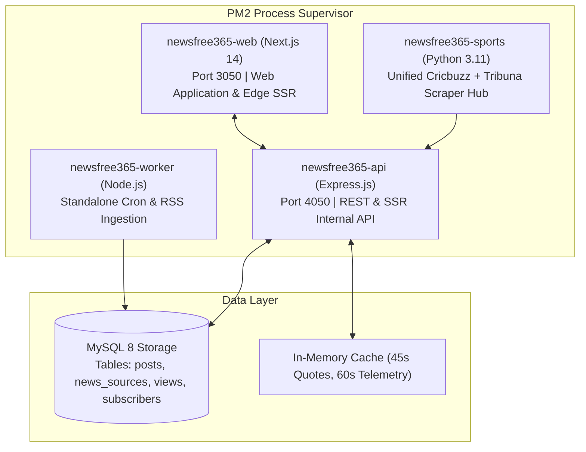
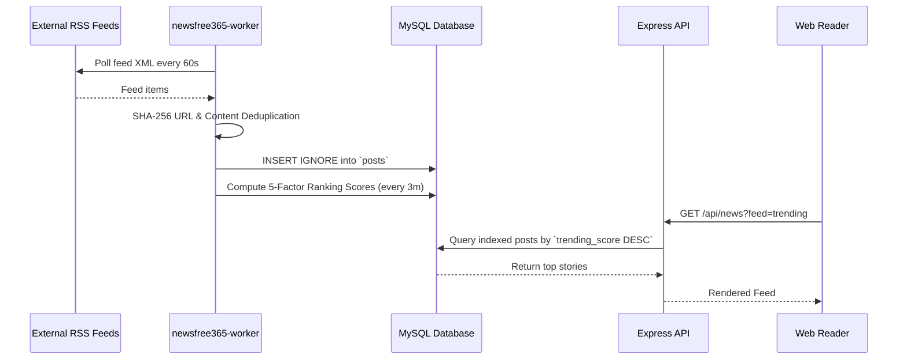

# NewsFree365 — System Architecture & Technical Specifications

This document defines the high-level architecture, module boundaries, data flows, caching hierarchies, and security models of the NewsFree365 news platform.

---

## 1. Architectural Principles

1. **Sub-Second TTFB & Edge Performance**: Next.js 14 App Router utilizes React Server Components (RSC) and Streaming SSR to render pages with near-instant initial paint.
2. **Off-Path Asynchronous Heavy Compute**: Ingestion, ranking calculation, RSS parsing, LLM rewriting, and sports scraping are strictly isolated into dedicated background workers and daemons.
3. **Zero-Downtime Hot Deployments**: Production compiles in background isolation without taking down active Node/Express PM2 cluster processes.
4. **Resilient Primary Source Grounding**: Every story retains primary canonical URL links, publisher attributions, and source verification metadata.

---

## 2. Process & Component Model

The application operates across 4 independent PM2 processes defined in `ecosystem.config.cjs`:

---

## 3. Data Pipelines & Lifecycle

### Ingestion Flow:

---

## 4. 5-Factor News Ranking System

Stories are dynamically ranked according to the formula:
$$\text{Score} = (\text{Freshness} \times w_1) + (\text{Velocity} \times w_2) + (\text{Engagement} \times w_3) + (\text{Authority} \times w_4) + (\text{Editorial} \times w_5)$$

- **Freshness**: Half-life exponential decay based on article publish timestamp.
- **Velocity**: Rate of change of views in the last 1–6 hours.
- **Engagement**: Weighted sum of likes ($3\times$), shares ($5\times$), and bookmarks ($4\times$).
- **Source Authority**: Dynamic tier multiplier (Tier 1 global wire vs niche beat).
- **Editorial Boost**: Pinned or breaking news boosts with automated TTL expiration.

---

## 5. Security & Isolation Model

- **Environment Isolation**:
  - Development builds use isolated cache `frontend/.next-dev/`.
  - Production builds live exclusively in `frontend/.next/`.
- **Admin Endpoints**: Protected via `x-admin-secret` authentication and IP-based rate limiting.
- **Content Sanitization**: Markdown and raw RSS HTML are strictly sanitized via DOMPurify to prevent XSS.
- **Database Safety**: Prepared SQL statements (`mysql2/promise` with parameterized queries) prevent SQL injection across all models.
